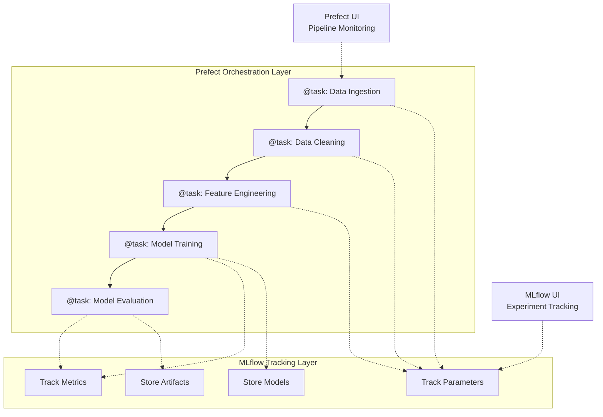

```mermaid
graph TB
    subgraph "Prefect Orchestration Layer"
        A["@task: Data Ingestion"]
        B["@task: Data Cleaning"]
        C["@task: Feature Engineering"]
        D["@task: Model Training"]
        E["@task: Model Evaluation"]
        
        A --> B
        B --> C
        C --> D
        D --> E
    end
    
    subgraph "MLflow Tracking Layer"
        F["Track Parameters"]
        G["Track Metrics"]
        H["Store Models"]
        I["Store Artifacts"]
    end
    
    A -.-> F
    B -.-> F
    C -.-> F
    D -.-> G
    D -.-> H
    E -.-> G
    E -.-> I
    
    J["Prefect UI<br/>Pipeline Monitoring"] -.-> A
    K["MLflow UI<br/>Experiment Tracking"] -.-> F
```