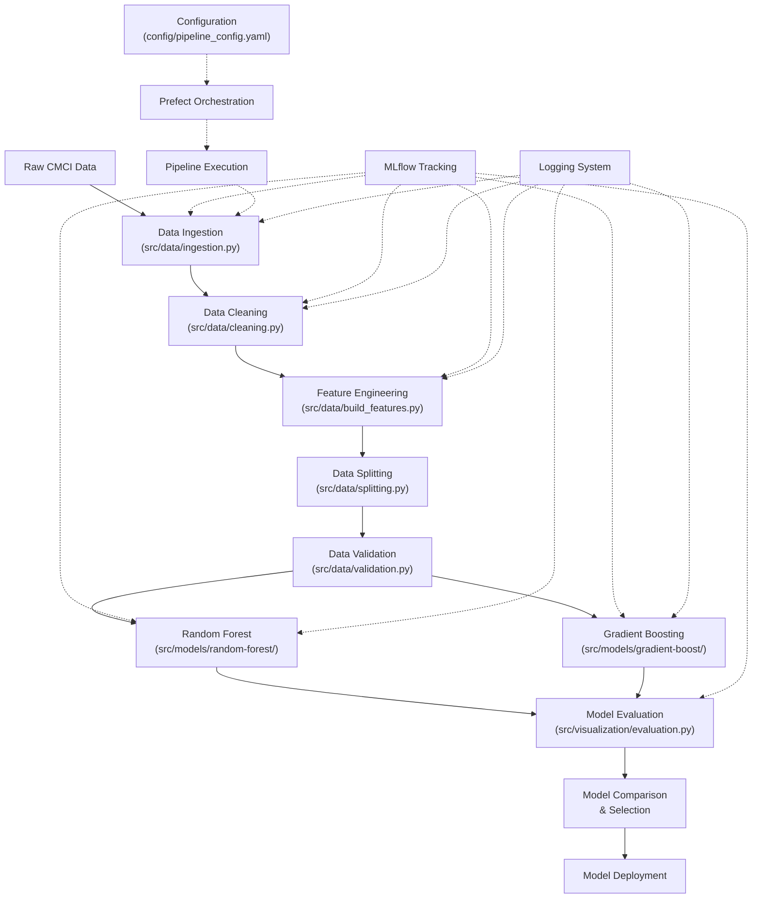

```mermaid
graph TD
    A["Raw CMCI Data"] --> B["Data Ingestion<br/>(src/data/ingestion.py)"]
    B --> C["Data Cleaning<br/>(src/data/cleaning.py)"]
    C --> D["Feature Engineering<br/>(src/data/build_features.py)"]
    D --> E["Data Splitting<br/>(src/data/splitting.py)"]
    E --> F["Data Validation<br/>(src/data/validation.py)"]
    
    F --> G["Random Forest<br/>(src/models/random-forest/)"]
    F --> H["Gradient Boosting<br/>(src/models/gradient-boost/)"]
    
    G --> I["Model Evaluation<br/>(src/visualization/evaluation.py)"]
    H --> I
    
    I --> J["Model Comparison<br/>& Selection"]
    J --> K["Model Deployment"]
    
    L["MLflow Tracking"] -.-> B
    L -.-> C
    L -.-> D
    L -.-> G
    L -.-> H
    L -.-> I
    
    M["Prefect Orchestration"] -.-> N["Pipeline Execution"]
    N -.-> B
    
    O["Configuration<br/>(config/pipeline_config.yaml)"] -.-> M
    
    P["Logging System"] -.-> B
    P -.-> C
    P -.-> D
    P -.-> G
    P -.-> H
```